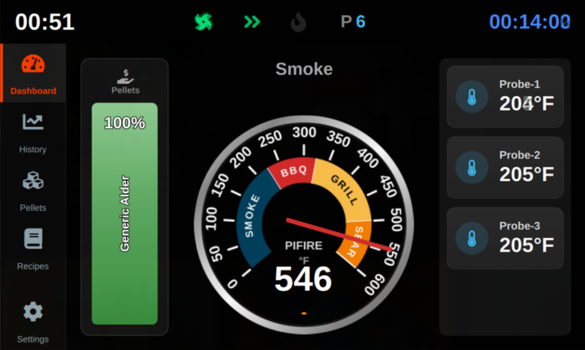

# PiFire Touch

**PiFire Touch** is a modern, touch-friendly graphical user interface for [PiFire](https://github.com/nebhead/PiFire), designed to run directly on a Raspberry Pi with a touch display. It leverages Qt6 (PySide6) and QML to provide a seamless, responsive, and aesthetically pleasing experience.




## ✨ Features

-   **Material Design UI**: Sleek, dark-mode interface built with Qt Quick Controls 2 (Material style).
-   **Real-time Monitoring**: Live updates of Grill temperature, Probes, and Timer status.
-   **Full Control**:
    -   Start/Stop the grill.
    -   Change Modes (Smoke, Hold, Shutdown, etc.).
    -   Adjust Target Temperatures.
    -   Set P-Mode and Smoke Plus settings.
-   **History Graphing**: Visualizing temperature history (Grill + Probes) directly on the screen.
-   **Multi-Platform**: Runs on Linux Desktop (for development) and Raspberry Pi (EGLFS/LinuxFB for production).

## 🛠 Prerequisites

### Hardware
-   Raspberry Pi (4, or 5 recommended).
-   Touchscreen display (HDMI or DSI) compatible with Raspberry Pi.
-   [PiFire](https://github.com/nebhead/PiFire) server running (either on the same Pi or another device).

### Software
-   **Python 3.9+**
-   **Qt6** dependencies (for EGLFS support on Raspberry Pi).

## 📦 Installation

### 1. Clone the Repository
```bash
git clone https://github.com/tukutt/pifire-touch.git
cd pifire-touch
```

### 2. Install Python Dependencies
Create a virtual environment (recommended) and install the requirements:
```bash
python3 -m venv .venv
source .venv/bin/activate
pip install -r requirements.txt
```

### 3. Configuration
By default, the application attempts to connect to `http://pifire.local`.

You can configure the server address directly within the application:
1.  Navigate to **Settings** > **Server Address**.
2.  Select your connection mode:
    -   **pifire.local** (Default)
    -   **localhost** (If running on the same device)
    -   **Custom IP/URL** (Enter a specific IP address using the on-screen keypad)

## 🚀 Usage

### Running on Desktop (Development)
You can test the UI on your desktop Linux environment:
```bash
./scripts/run_desktop.sh
```

### Deployment & Running on Raspberry Pi

**1. Deploy from Desktop:**
Use the deployment script to copy files to your Raspberry Pi.
```bash
# Default (defaults to pifire.local)
./scripts/deploy.sh

# Or specify IP
./scripts/deploy.sh 192.168.1.50
```

**2. First-time Setup on Pi:**
SSH into your Pi and run the setup scripts.

*Install Python Environment (Dependencies):*
```bash
/home/pi/pifire-touch/scripts/install_venv.sh
```

*Install System Dependencies (Qt6/OpenGL/Cage & Permissions):*
```bash
/home/pi/pifire-touch/scripts/setup_remote.sh
```
*Note: A REBOOT is required for Cage/Wayland backend to function correctly.*

**3. Start the Application:**
To launch the interface in full-screen (framebuffer) mode:
```bash
/home/pi/pifire-touch/scripts/run_remote.sh
```

**4. Stop the Application:**
To kill running instances:
```bash
/home/pi/pifire-touch/scripts/kill_remote.sh
```

## 📝 ToDo
- [ ] Pellet management
- [ ] Recipes
- [ ] PWM Fan control
- [ ] Alarm on probe
- [ ] A better History graph
- [ ] Some Settings
- [ ] Your idea :)


## 📄 License
[GPLv3 License](LICENSE)
